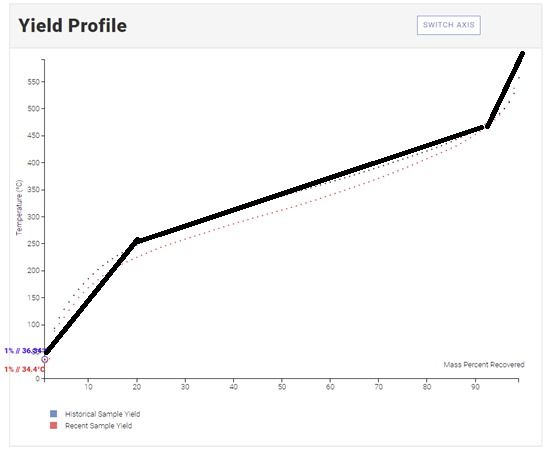

# :chart_with_upwards_trend: Mixed Oil Distillation (MOD)

MOD is an application that creates a new distillation profile given 2 existing crude oil profiles via the [Crude Monitor](https://www.crudemonitor.ca/) website.

### Tools Used:

_Please ensure these tools are all downloaded before running the application_

- Google Chrome
- Python (v3.7.7)
- Jupyter Notebook
- Pandas
- Numpy
- Matplotlib
- Selenium

_For more info on which versioned were used please see [requirements.txt](requirements.txt)_

### How to run the application:

1. Ensure that all cells in the Juptyer Notebook client has ran through once and that all modules have imported correctly. Failure to do so may result in an error.
2. Go on https://www.crudemonitor.ca/home.php and select the oil profile you wish to evaluate. Then click into their distillation button to view the distillation dashboard. _Note that condensate oils do not have distillation profiles_.
3. Copy the link of the distillation webpage and save it into `url_a` variable in the application cell. Do the same for another oil profile except for `url_b`.
4. Insert desired percentage volume you wish to evaluate and save it into the `percentage` variable. _Ensure the temp is between 5-99, or errors will occur_.
5. Execute the application cell and view your results.

### Implementation

When approaching the problem I decided to divide the application into 2 sepearte scripts.

1. `scraper.py` which is a web scraper that retrieves data off Crude Monitor.
2. `main.ipynb` which is the main application that runs the distillation analysis on a Jupyter Notebook client.

I decided to use Jupyter Notebook for this assessment because it made more sense to organize the main application in 4 different cells. The imports, functions, test cases, and the application. Also, Jupyter takes advantage of not having to recompile the entire script just to run a specific cell.

You'll notice that the application will never require the user to copy a path for the chrome driver, this is because the scraper utilizes the ChromeDriverManager tool that will automatically checks and installs the latest chrome driver.

Also, in the functions cells I tried to do as much code resuse as possible to make the code more modular and to make it easier to run tests and to debug.

### Assumptions

When working on the assessment a couple of assumptions were to simplify the overall analysis.

**Chemical Reaction Simplification**
When mixing two different oils its an over simplication to assume that combining the two oils will result in an average of both their distillation profiles. In the real world, there may be other factors that contribute to the results. Maybe one oil has a higher influence on changing values than the other thus skewing the overall results.

**Polynomial Trend Assumption**

Before starting the assessment I looked at various oils distillation profiles to see if I can notice any common characteristics in how the graph looks. Overall, all the oils follow a similar trend. Looking at the example above we can break this trend into 3 different sections, from the 0-15% (beginning) , 15-90% (middle), and 90% - 100% (end). Where each individual section follow their own rate of change. With that in mind, it made the most to make the regression function a 3rd degree polynomial. Also, almost of 3rd degree polynomial function I've tested showed a r-squared value of >98%.
